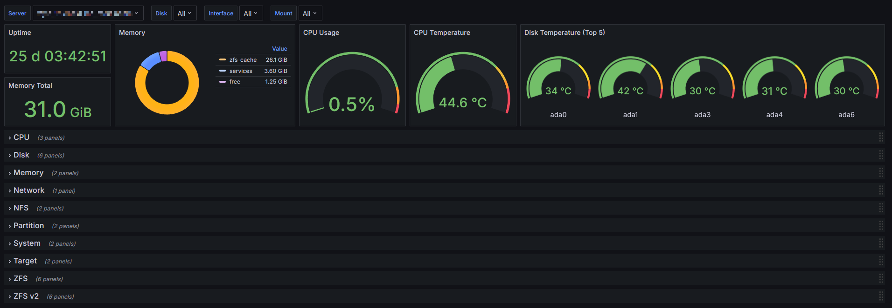
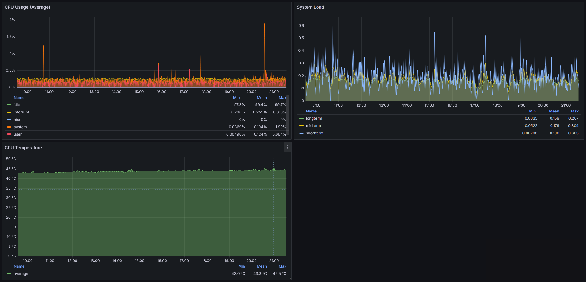
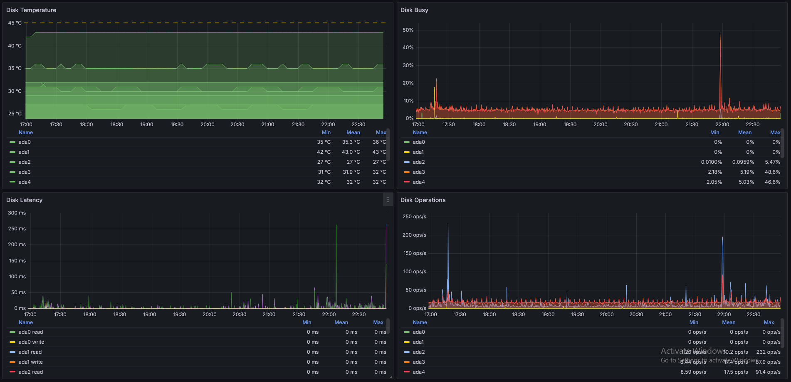

# TrueNAS CORE Grafana Dashboard

This dashboard aims to replicate most of the metrics shown in the Reporting and Dashboard sections of the TrueNAS CORE
web interface. It has been tested with v13 but may work with older versions as well. It will not work with TrueNAS
SCALE.

TrueNAS CORE sends metrics using the Graphite protocol, and the dashboard requires a Graphite data source.
[VictoriaMetrics](https://docs.victoriametrics.com/#graphite-api-usage) is a simple way to setup a receiver for Graphite
metrics which also has the Graphite API support Grafana requires.

## Setup

1. Configure the TrueNAS [Graphite options](https://www.truenas.com/docs/core/13.0/uireference/system/reporting/) under
System > Reporting, check both "Report CPU usage in percent" and "Graphite Separate Instances".

2. Create a Graphite data source in Grafana, using VictoriaMetrics (or another solution) as the source.

3. Import the dashboard using the `dashboard-truenas.json` file, or via the public Grafana [dashboard library](https://grafana.com/grafana/dashboards/22925-truenas-core-v13/).

## Notes

The ZFS "ARC Requests" metrics in the TrueNAS Reporting section have and odd 100 times multiplier applied, this appears
in the code [here](https://github.com/truenas/middleware/blob/truenas/13.0-u6.3-stable/src/middlewared/middlewared/plugins/reporting/plugins.py#L294).
The collectd [ZFS ARC plugin](https://github.com/collectd/collectd/wiki/Plugin-ZFS-ARC) (the source for the Graphite
metrics) and the `arcstat` tool return very similar values, suggesting the "Reporting" graphs are the anomaly.

Summing the series under the path `servers.$server.memory.memory.*` may not total all memory available to the system.
There doesn't appear to be another method (using Graphite alone) to get a "total memory" metric.

## Preview images

